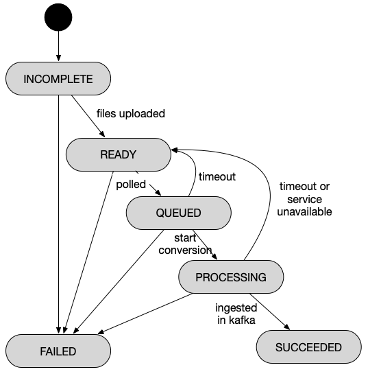

# Manual data upload Kafka connector architecture

The manual data upload Kafka connector will have the following components:

- Data upload frontend
- Data upload backend
- Kafka source connector

The frontend reads project settings from the ManagementPortal and uses the ManagementPortal permission system to manage projects. It can upload files with given file types to the backend and can report the status of the files. The backend stores files and file metadata, and manages updates. Finally, Kafka source connector reads file records from the data upload backend and processes them with custom converters.

It will use approximately the following architecture:


[Architectural decisions for this project](https://github.com/RADAR-base/radar-upload-source-connector/blob/master/docs/adr/index.md) are separately documented.

The backend has the following API calls. All content types are `application/json` unless otherwise specified.

## Source types

**Get converter types**
`GET /source-types`

```json
{
  "sourceTypes": [
    {
      "name": "Mp3Audio",
      "contentTypes": ["application/mp3", "audio/mp3"],
      "topics": [
        "high_quality_mp3_audio",
        "low_quality_mp3_audio"
      ],
      "timeRequired": true
    },
    {
      "name": "WrittenText",
      "contentTypes": ["text/csv", "text/json"],
      "topics": ["written_text"],
      "timeRequired": false
    }
  ]
}
```
These are the source types that are currently registered with the backend. More can be registered by modifying the backend configuration. The `timeRequired` field indicates whether the user should specify a start time corresponding to a data record, if the data does not contain a time itself.

**Get converter configuration**
`GET /source-types/{name}`

```json
{
  "name": "Mp3Audio",
  "contentTypes": ["application/mp3", "audio/mp3"],
  "topics": [
    "high_quality_mp3_audio",
    "low_quality_mp3_audio"
  ],
  "requiresTime": true,
  "settings": {
    "projects": {
      "radar-test": {
        "bitRate": 44100
      }
    },
    "defaults": {
      "bitRate": 16000
    }
  }
}
```

If the converter is customizable, the backend can provide it with additional configuration properties.

## Records

All uploads are stored in so-called records. A record may contain one or more files that should be processed. To track the status of a record, use the `metadata.status` field. This field follows the state transitions as outlined below.



### Implementing a data uploader

**Create a new record**
`POST /records`

```json
{
  "data": {
    "projectId": "radar-test",
    "userId": "testUser",
    "sourceId": "source",
    "time": "2019-03-04T00:00:00",
    "timeZoneOffset": 0
  },
  "sourceType": "Mp3Audio" 
}
```
Returns

`HTTP 201 Created`<br>
`Location: /records/{id}`

```json
{
  "id": 12,
  "data": {
    "projectId": "radar-test",
    "userId": "testUser",
    "sourceId": "source",
    "time": "2019-03-04T00:00:00",
    "timeZoneOffset": 0
  },
  "sourceType": "Mp3Audio", 
  "metadata": {
    "createdDate": "2019-03-04T01:23:45Z",
    "modifiedDate": "2019-03-04T01:23:45Z",
    "status": "INCOMPLETE",
    "revision": 1
  }
}
```

**PUT record data**
`PUT /records/{id}/contents/{fileName}`<br>
`Content-Type: audio/mp3` (for example)<br>

```
...file contents...
```

This creates a new data file corresponding to the record.

Returns `HTTP 200` or `HTTP 201` if existing and the state is incomplete, with body

```json
{
  "fileName": "Gibson.mp3",
  "createdDate": "2019-03-04-T01:23:45Z",
  "contentType": "audio/mp3",
  "size": 10,
  "url": "/records/{id}/contents/{fileName}"
}
```

**Mark record ready for processing** `POST /records/{id}/metadata`

```json
{
  "status": "READY",
  "revision": 1
}
```

**Get the logs**
`GET /records/{id}/logs`
```
Content-Type: text/plain
Content-Length: 12345

...
```

**Reset a record to initial state to allow reprocessing**

`POST /records/{id}/reset`
with empty body.

**Get records for given filters**<br>
`GET /records`<br>
`GET /records?projectId=radar-test&userId=testUser&sourceType=Mp3Audio&status=READY&size=5&page=1`

```json
{
  
  "page": 1,
  "size": 5,
  "totalElements": 5,
  "records": [
    {
      "id": 12,
      "data": {
        "projectId": "radar-test",
        "userId": "testUser",
        "sourceId": "source",
        "time": "2019-03-04T00:00:00",
        "timeZoneOffset": 0,
        "contents": [{
          "fileName": "Gibson.mp3",
          "createdDate": "2019-03-04-T01:23:45Z",
          "contentType": "audio/mp3",
          "size": 10,
          "url": "/records/{id}/contents/{fileName}"
        }]
      },
      "sourceType": "Mp3Audio",
      "metadata": {
        "revision": 2,
        "createdDate": "2019-03-04T01:23:45Z",
        "modifiedDate": "2019-03-04T01:23:45Z",
        "committedDate": null,
        "status": "READY",
        "message": "Data has succesfully been uploaded to the backend.",
        "logs": null
      }
    }
  ]
}
```

### Implementing a data converter

A data processor should fetch the latest records from the queue, mark them as processing, process them by e.g. storing them in Kafka or S3, and then mark them as failed or succeeded. All processing actions should be logged in the record logs element.

**For polling queued data**
`POST /poll`

```json
{
  "limit": 10,
  "supportedConverters": ["Mp3Audio", "WrittenText"]
}
```

requests all data that is currently queued, only for given supported converters. This means that data with different formats can independently be converted by different backends, each polling only for their own source type.

The request returns

```json
{
  "limit": 10,
  "records": [
    {
      "id": 12,
      "data": {
        "projectId": "radar-test",
        "userId": "testUser",
        "sourceId": "source",
        "time": "2019-03-04T00:00:00",
        "timeZoneOffset": 0,
        "contents": [{
          "fileName": "Gibson.mp3",
          "createdDate": "2019-03-04-T01:23:45Z",
          "contentType": "audio/mp3",
          "size": 10,
          "url": "/records/{id}/contents/{fileName}"
        }]
      },
      "sourceType": "Mp3Audio",
      "metadata": {
        "createdDate": "2019-03-04T01:23:45Z",
        "modifiedDate": "2019-03-04T01:23:45Z",
        "status": "QUEUED",
        "message": "Data has been queued for processing.",
        "revision": 3
      }
    }
  ]
}
```

**Start transaction**
`POST /records/{id}/metadata`

```json
{
  "revision": 3,
  "status": "PROCESSING",
  "message": "Data is being processed."
}
```

returns
HTTP 200

```json
{
  "id": 12,
  "revision": 4,
  "status": "PROCESSING",
  "message": "Data is being processed."
}
```

or HTTP 409 Conflict if the revision does not match (i.e. another process is processing this file.)

**Get file contents**
`GET /records/{id}/contents/{fileName}`<br>
`Content-Type: application/mp3`
```
...file contents...
```

**Finalize transaction**
`POST /records/{id}/metadata`

```json
{
  "id": 12,
  "revision": 4,
  "status": "FAILED | SUCCEEDED",
  "message": "Cannot process data: ... | Data was successfully committed.",
  "logs": {
    "contentType": "application/json",
    "contents": "..."
  }
}
```

Returns

```json
{
  "revision": 5,
  "status": "SUCCEEDED",
  "message": "Data was successfully committed.",
  "logs": {
    "url": "/records/12/logs"
  }
}
```

or HTTP 409 Conflict if the revision does not match (i.e. another process is processing this file.)
